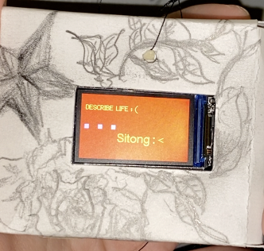

# GenerativeArt

This project is a collaborative effort to demostrate the generative side of computational art.
The detailed artistic vision and visual display can be found [here](https://water-honeydew-380.notion.site/Generative-Art-089ead419a03436f984450d8fe813835).

## Technical Guide

### Materials Needed

- ESP32 TTGO T-display
- battery
- wooden stick
- string
- some durable paper
- tape

### Detailed Steps to install the Art

1. solder the battery to appropriate wires
2. connect the battery and charge the ESP32 for 2 hours
3. download the code and upload it to the device
    1. recommend to use Arduino IDE
    2. check out appropriate tutorials for set up
    3. **test** to see if the screen displays the content as wanted
4. wrap the paper(or other durable materials) around the device to protect it
5. tie the string to the paper and the wooden stick
    1. use tape to make sure the pieces stick together
6. hang you art piece(s)!
